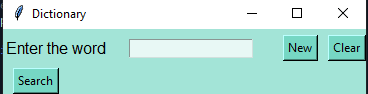
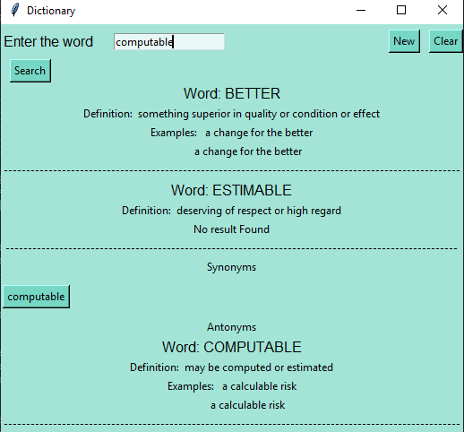

# Dictionary
Making a GUI for dictionary using Tkinter

I am using the nltk Wordnet as the set of words for dictionary
Read more on https://www.nltk.org/howto/wordnet.html

Starting Gui

Searching for words.

